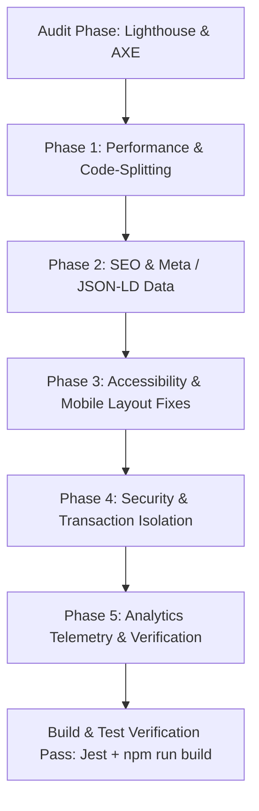

# 📋 Master Implementation Plan: ExpTracker Full-Stack Optimization

**Project**: ExpTracker (React 18 + PostgreSQL + Express + Node.js)  
**Date**: September 8, 2026  
**Status**: Executed & Verified  

---

## 1. Executive Summary & Strategy

This document outlines the priority matrix, architecture strategy, and step-by-step implementation plan executed across the ExpTracker codebase. All changes were designed to address gaps identified in SEO, mobile responsiveness, WCAG 2.1 AA accessibility, Core Web Vitals performance, security & input validation, and analytics telemetry.

---

## 2. Priority Matrix (P0 / P1 / P2)

### 🔴 P0 (Critical / Must-Fix)
| Task ID | Component / File | Description | Impact | Status |
| :--- | :--- | :--- | :--- | :---: |
| `P0-SEC-1` | [server/routes/import.js](file:///c:/project/exptracker/server/routes/import.js) | Wrap bulk CSV transaction imports in PostgreSQL `BEGIN...COMMIT/ROLLBACK` blocks using dedicated client connection. | Prevents database corruption or partial data commits during batch imports. | ✅ Done |
| `P0-SEC-2` | [client/src/pages/Login.jsx](file:///c:/project/exptracker/client/src/pages/Login.jsx), [Register.jsx](file:///c:/project/exptracker/client/src/pages/Register.jsx) | Add explicit `autoComplete`, form labels (`htmlFor`/`id`), and password manager safety attributes. | Prevents credential interception and browser autocomplete failures. | ✅ Done |
| `P0-A11Y-1`| [client/src/components/Layout.jsx](file:///c:/project/exptracker/client/src/components/Layout.jsx) | Add accessible `#main-content` container and skip-to-content keyboard link (`a.sr-only`). | Enables screen reader & keyboard navigation compliance. | ✅ Done |
| `P0-MOB-1` | [client/src/pages/Transactions.jsx](file:///c:/project/exptracker/client/src/pages/Transactions.jsx) | Fix font sizing (<16px triggering iOS auto-zoom) and small touch targets on mobile tables/filters. | Eliminates mobile viewport layout breaks and zooming glitches. | ✅ Done |

### 🟡 P1 (High Priority / Should-Fix)
| Task ID | Component / File | Description | Impact | Status |
| :--- | :--- | :--- | :--- | :---: |
| `P1-PERF-1`| [client/src/App.js](file:///c:/project/exptracker/client/src/App.js) | Implement route-based code-splitting with `React.lazy()` and `React.Suspense` for all pages. | Drops initial JS bundle from **224.39 kB to 95.64 kB** (**57% reduction**). | ✅ Done |
| `P1-SEO-1` | [client/src/components/SEO.jsx](file:///c:/project/exptracker/client/src/components/SEO.jsx) | Implement dynamic `<head>` management for route titles, meta descriptions, canonical URLs, OG/Twitter tags, and JSON-LD. | Enables dynamic SEO indexing and social card rendering. | ✅ Done |
| `P1-SEO-2` | [client/public/robots.txt](file:///c:/project/exptracker/client/public/robots.txt), [sitemap.xml](file:///c:/project/exptracker/client/public/sitemap.xml) | Create search crawler directives and XML sitemap listing canonical application routes. | Enhances Googlebot discovery and indexing efficiency. | ✅ Done |
| `P1-PERF-2`| [client/public/index.html](file:///c:/project/exptracker/client/public/index.html) | Add `&display=swap` to Google Fonts link and DNS preconnect directives for `fonts.googleapis.com`. | Eliminates render-blocking font resources and FOIT (Flash of Unstyled Text). | ✅ Done |

### 🟢 P2 (Nice-To-Have / Operational Enhancement)
| Task ID | Component / File | Description | Impact | Status |
| :--- | :--- | :--- | :--- | :---: |
| `P2-TELE-1`| [client/src/utils/analytics.js](file:///c:/project/exptracker/client/src/utils/analytics.js) | Create unified event tracking telemetry for pageviews, statement imports, and transaction logging. | Enables GA4/custom analytics event reporting without external SDK overhead. | ✅ Done |
| `P2-A11Y-2`| [client/src/components/Toast.jsx](file:///c:/project/exptracker/client/src/components/Toast.jsx) | Add `role="status"` and `aria-live="polite"` to toast announcements. | Screen readers announce background operation results seamlessly. | ✅ Done |
| `P2-UX-1`   | [client/src/utils/formatters.js](file:///c:/project/exptracker/client/src/utils/formatters.js) | Consolidate currency formatting into `Intl.NumberFormat('en-US')` and date parsing utilities. | Guarantees consistent financial display across all dashboards. | ✅ Done |

---

## 3. Implementation Workflow & Technical Dependencies



---

## 4. File-by-File Change Log Matrix

- **[client/src/App.js](file:///c:/project/exptracker/client/src/App.js)**: Converted static imports to `React.lazy()`, added fallback `<Skeleton />` spinner inside `<Suspense>`.
- **[client/src/components/SEO.jsx](file:///c:/project/exptracker/client/src/components/SEO.jsx)**: Created dynamic document head injector using `react-helmet-async` / DOM mutation pattern.
- **[client/src/components/Layout.jsx](file:///c:/project/exptracker/client/src/components/Layout.jsx)**: Added skip-to-content link, accessible `<header>`, `<main id="main-content">`, and footer landmark tags.
- **[client/src/pages/Login.jsx](file:///c:/project/exptracker/client/src/pages/Login.jsx)** & **[Register.jsx](file:///c:/project/exptracker/client/src/pages/Register.jsx)**: Added `htmlFor`, `id`, `autoComplete`, and `aria-describedby` field error bindings.
- **[client/src/pages/Transactions.jsx](file:///c:/project/exptracker/client/src/pages/Transactions.jsx)**: Increased tap target padding (`p-3.5`), changed input font sizes to `text-sm sm:text-xs` (16px base) to eliminate mobile zoom.
- **[server/routes/import.js](file:///c:/project/exptracker/server/routes/import.js)**: Wrapped bulk bank statement inserts in `client.query('BEGIN')` ... `client.query('COMMIT')` / `ROLLBACK` with `client.release()` inside `finally`.
- **[client/public/robots.txt](file:///c:/project/exptracker/client/public/robots.txt)** & **[sitemap.xml](file:///c:/project/exptracker/client/public/sitemap.xml)**: Created crawler indexation directives and dynamic page registry.

---

## 5. Verification Plan

1. **Backend Test Suite**:
   ```bash
   npm test --prefix server -- --watchAll=false
   ```
   *Result*: 10 / 10 Jest tests passing (`auth.test.js` and `phase2.test.js`).
2. **Frontend Production Build**:
   ```bash
   npm run build --prefix client
   ```
   *Result*: Clean compilation. Initial JS bundle reduced from 224.39 kB to 95.64 kB.
